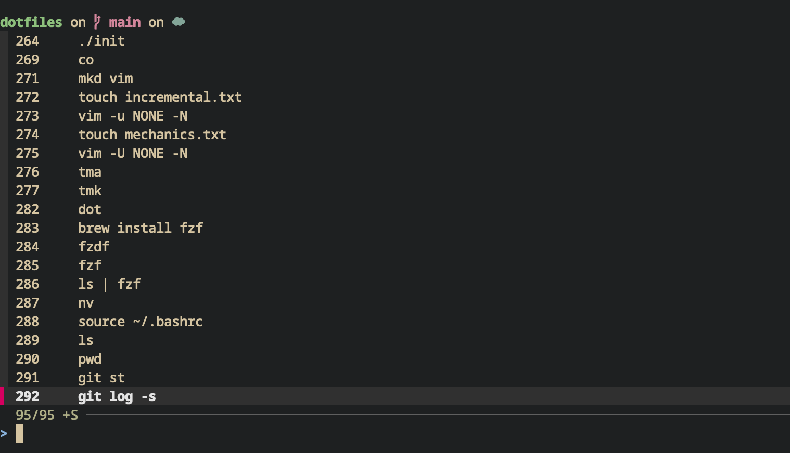

[`fzf`](https://github.com/junegunn/fzf) is a command-line fuzzy-finder you can run in your terminal to filter any list of files, command history, and more. `fzf` is versatile and can be used in combination with other tools such as grep and Git.

In this blog post, we’ll explore how to create small bash helpers for Git using `fzf`.
By the end of this post, you’ll understand what `fzf` is and how to combine its power with other tools. I hope this tutorial also gives you lots of ideas for applying similar techniques to build your own helpers. Let's get started!

> **Note**: if you're looking for a prebuilt plugin with Git and fzf integrations, check out [fzf-git.sh](https://github.com/junegunn/fzf-git.sh) by the creator of fzf. This blog post focuses on building small helpers from scratch combining different programs to make the whole thing less intimidating. Playing around with Bash and fzf is a lot of fun. I hope you enjoy the post!

## What fzf is and how to install it

`fzf` is a command-line fuzzy-finder. It is a tool that enables you to quickly browse any kind of list and search for matches by typing.

In the `fzf` repository on Github, you can find [detailed instructions on how to install it based on your operating system](https://github.com/junegunn/fzf?tab=readme-ov-file#installation).

On MacOS, the easiest way is to install it using `homebrew`:

```sh
brew install fzf
```

Once you’ve installed it, if you type `fzf` in your terminal, you should see a list of all the files in your current directory.

```sh
fzf
```

## Integrate fzf with Bash

`fzf` integrates well with several shells, including Bash and Zsh. Integrating it with your shell activates a series of cool features, such as being able to select a command in your command-line history and paste it.

Add this to your `bashrc`:

```sh
# Set up fzf key bindings and fuzzy completion
eval "$(fzf --bash)"
```

If you are following along using another shell, check out [the official documentation on how to set shell integration](https://github.com/junegunn/fzf?tab=readme-ov-file#setting-up-shell-integration).

Don’t forget to source your shell config after modifying it (e.g., `source ~/.bashrc`).

Now, what does adding shell integration do?
You should now be able to type `<Ctrl-r>` (Control key + r) in your terminal, select a command from your history, and paste it directly into your terminal.



I use this keybinding **all the time**. Now, let’s move to the next level and see how we can build useful utilities with `fzf`.

## Combine the power of fzf with Git to create small helpers

`fzf` is a fuzzy-finder, and you can pipe data from many sources, including Git, into it. This makes it easy to create small helpers. Let’s build a couple of helpers to use Git more efficiently.
To follow along, create a new file in your home directory called `.bash_helpers` (you can call it whatever you want!):

```sh
touch ~/.bash_helpers
```

Then, source it in your `.bashrc`. Sourcing it tells your shell to import all the functions from the `~/.bash_helpers` so you can use them.

```sh
# Add this to your ~/.bashrc
source ~/.bash_helpers
```

It is a good way to keep things more organized.

> After modifying `.bashrc` or `.bash_helpers`, don't forget to source your shell config (`source ~/.bashrc`) in your terminal to apply the changes.

### Let’s create a helper to check out a specific git branch

If you navigate to a local Git repository, you can list all of your branches using:

```sh
git --no-pager branch
```

In the above command:

- `--no-pager` is used to remove Git pagination and get the full list of branches.

If we pipe it to `fzf`, we end up with a list of the git branches that we can search through and select.

```sh
git --no-pager branch | fzf
```

The idea for this first example is to create a helper that shows us the list of branches through `fzf` and, when we select a branch, we switch to that branch.

In the `.bash_helpers`, let’s create a function and let’s call it, for instance, `sfb` (for `“switch find branch”`):

```bash
function sfb() {
	local line branch
	line=$(git --no-pager branch -vv | fzf)
	branch=$(echo "$line" | sed -E 's/^[* ]+([^ ]+).*/\1/')
	git switch "$branch"
}
```

Let's break down what this function does:

- With `local`, we create two local variables scoped to the function: `branch` and `line`.
- `line` stores the full row selected from the fzf list, which includes extra info like the tracking status.
- `branch` stores the branch name extracted from the `line` variable.
- We use `sed` to extract the branch name. When you run `git branch`, you’ll see output like this: an asterisk in front of your current branch and some extra information like tracking details. The `sed` command strips away all this extra formatting to get a clean branch name.
- Let's look at what this `sed` command `sed -E 's/^[* ]+([^ ]+).*/\1/'` does.
  - `sed` is called a stream editor. It is a way to modify a stream of text.
  - `-E` enables us to pass a regular expression to sed to edit a given string.
  - `^[* ]+`: We start by matching any asterisk or space at the start of the line.
  - `([^ ]+)`: It is a capture group for the branch name. It takes any subsequent character that is not a space. And it will stop the capture group once it encounters a space.
  - `.*`: We match with `.*` any other character that follows the branch name.
  - With `\1`, we tell `sed` to replace the input string with the capture group that contains the branch name.
- `git switch` is equivalent to `git checkout` and will check out the branch we selected.

Next, before testing it, we could add an extra check to make sure the command is run in a Git repository. Let's use the handy command `git rev-parse --is-inside-work-tree`. [This Git command](https://git-scm.com/docs/git-rev-parse#Documentation/git-rev-parse.txt---is-inside-git-dir) returns a boolean indicating whether we are in a Git repository or not.

```bash
function sfb() {
	if ! git rev-parse --is-inside-work-tree &>/dev/null; then
		echo "Error: Not inside a Git repository"
		return 1
	fi

	local line branch
	line=$(git --no-pager branch -vv | fzf)
	branch=$(echo "$line" | sed -E 's/^[* ]+([^ ]+).*/\1/')
	git switch "$branch"
}
```

- `git rev-parse` returns a boolean. If it returns `false`, we exit the function.
- `&>/dev/null`: It is a way to ignore the output of the Git command. `&>` redirects both standard output and standard error to `/dev/null`, which is what is called a ["Null device"](https://en.wikipedia.org/wiki/Null_device). It is a way to discard the command output completely.

Let’s give it a go. Save your file and go back to your shell. Source your bashrc (`source ~/.bashrc`). Go to a local repository that has several branches and type in your command line:

```bash
sfb
```

Here's an example output of running this command:


You should see the fzf picker showing all your Git branches. The `*` in front of the branch indicates your current checked-out branch. If you select one, you should now be checked out on that other branch.

### Extracting the `git rev-parse` check in its own function

We will reuse the logic to check whether the directory is a Git repository. Let's extract the logic with `git rev-parse` in a function for easier reuse. In your `.bash_helpers`, add:

```bash
function ensure_git_repo() {
	  if ! git rev-parse --is-inside-work-tree &>/dev/null; then
        echo "Error: Not inside a Git repository"
        return 1
    fi
}
```

We can then use it in our `sfb` helper:

```bash
function sfb() {
	ensure_git_repo || return 1

	local line branch
	line=$(git --no-pager branch -vv | fzf)
	branch=$(echo "$line" | sed -E 's/^[* ]+([^ ]+).*/\1/')
	git switch "$branch"
}
```

`ensure_git_repo || return 1` is a shorthand syntax. It is equivalent to doing:

```bash
	if ! ensure_git_repo; then
		return 1;
	fi
```

With the `||` syntax, if the first expression is truthy, the second expression does not get checked. In our case, if `ensure_git_repo` is successful (returns 0), the `return 1` won't get evaluated.

### Let's create a helper to delete a Git branch using fzf

Using a very similar logic, we can create a helper to delete a branch.
Let’s create another function `dfb` (that stands for “delete find branch”) and reuse the branch selection through `fzf` logic:

```bash
function dfb() {
	# Let's use our helper to check if it is a Git repository
	ensure_git_repo || return 1

	local line branch
	line=$(git --no-pager branch -vv | fzf)
	branch=$(echo "$line" | sed -E 's/^[* ]+([^ ]+).*/\1/')
}
```

Now, because it is a destructive operation, let’s add a confirmation step. With Bash, we can use `read -p` to get user input and confirm that the user wants to delete the branch:

```bash
function dfb() {
	ensure_git_repo || return 1

  local line branch
	line=$(git --no-pager branch -vv | fzf)
	branch=$(echo "$line" | sed -E 's/^[* ]+([^ ]+).*/\1/')

	# show the user what command it is about to run
	echo "git branch -D $branch"
	read -p "Are you sure you want to delete this branch? [y|n]" -n 1
	echo ""

	if [[ $REPLY =~ ^[Yy]$ ]]; then
		git branch -D "$branch"
	else
	  echo "Branch deletion aborted"
  fi
}
```

- `read -p` will prompt the user. `-n 1` means we only take one character from the user input.
- `$REPLY` is a global shell variable. By default, `read` will store the user input in `$REPLY`
- In the `if` statement, we use `=~` to match the user input with a regular expression `^[Yy]$`. If the user types `Y` or `y`, we delete the branch.

Let’s try it out. In your shell, source your bashrc and then type:

```sh
dfb
```

It should show you a list of branches. If you select one, you will be prompted to confirm whether you want to delete it.

![Shows the output of running the function `dfb` in the terminal. Once a branch to delete is selected, it shows a confirmation prompt that says, "Are you sure you want to delete this branch? [y|n]"](../img/git_branches_delete-confirm.png)

### Let’s create a helper to choose a commit to rebase a branch onto

One of my favorite Git + fzf utilities is one I call `gri`. It enables me to choose the commit I want to rebase my branch on. Let’s build this one together.

First, let’s create a Bash function called `gri` (it stands for “git rebase interactive”).

```bash
function gri() {
	ensure_git_repo || return 1
}
```

First, we need to list all the commits and pipe them to fzf.

```sh
git log --color=always --pretty=oneline --abbrev-commit
```

- `--color=always` keeps the colored output.
- `--pretty=oneline` keeps the commit information on a single line.
- `--abbrev-commit` shortens the commit hash.

If you try out this command, it will print out in this format:


Next, we need to pipe it into fzf to allow the user to select a commit.

```bash
function gri() {
	ensure_git_repo || return 1

	local line commit
	line=$(git log --color=always --pretty=oneline --abbrev-commit | fzf --ansi)
}
```

To keep the colored output, we pass `--ansi` to `fzf`.

To extract just the commit hash, we can use `sed` again. Here’s what the final function looks like:

```bash
function gri() {
	ensure_git_repo || return 1

	local line commit
	line=$(git log --color=always --pretty=oneline --abbrev-commit | fzf --ansi)

	if [[ -z "$line" ]]; then
		return
	fi

	commit=$(echo "$line" | sed -E "s/^([^ ]+).*/\1/")
	git rebase "$commit"
}
```

- We use a capture group in the regular expression in `sed` to capture the commit hash only.
- `-z` is a string test operator in Bash. It checks if the string is empty. This condition handles the case when the user doesn’t select a commit.

Now test it in your terminal:

```sh
gri
```

You should see a menu with your commits. If you select one, you’ll be taken to Git’s interactive rebase menu.

## Other ideas

In this post, we explored the power of fzf, taking `git` as an example. But you can use it with many other programs. One recent use case I had was that I wanted to select a Docker container to execute a command inside of it. At work, I have at times 60 containers running simultaneously, so it can be tricky to find the one I’m looking for.

I ended up doing a command that looked like that:

 `docker exec -it $(docker ps --format "{{.Names}}" | fzf) sh` 

- `docker container exec` allows you to execute a command inside a running container.
- `-it` means that I want to have an interactive mode within the container.
- `sh` is the program I want to launch within the container.
- `docker ps --format “{{.Names}}”` lists out only the names of the containers.

We could put this command in a Bash function, too. There are so many useful use cases of using `fzf`. The sky is really the limit!

## Complete code from this post

You can find all the code from this post in the [fzf-git-tutorial repository](https://github.com/liv7c/fzf-git-tutorial) on Github.

## Conclusion

In this blog post, we explored `fzf` and built together a couple of Bash utils combining the power of `fzf` with `Git`. We built one to check out a Git branch, being able to pick from the available local branches. We also looked at how to build a helper to rebase onto a commit by using `fzf` to see a list of the different commits. We've only really scratched the surface of all the useful things we could do with `fzf`. I hope this blog post gives you some ideas! You can find all the code examples from this tutorial in the [fzf-git-tutorial repository](https://github.com/liv7c/fzf-git-tutorial). Like always, if you have any questions or would like to share some of your own utils, don’t hesitate to reach out on [Bluesky](https://bsky.app/profile/oliviac.dev)!

## Versions used in this post

Here are the versions of Bash and fzf used in this post:

```sh
bash --version
# GNU bash, version 5.2.37(1)-release (aarch64-apple-darwin23.4.0)

fzf --version
# 0.65.0

git --version
# git version 2.50.0
```

You don't need these exact versions, but if you run into any issues (particularly with Bash), try updating Bash or fzf.

## Further resources

- [fzf Github repository](https://github.com/junegunn/fzf)
- [Bash scripting cheatsheet](https://devhints.io/bash)
- [fzf-git-tutorial repository](https://github.com/liv7c/fzf-git-tutorial)
- [My Bash utility functions in my dotfiles](https://github.com/liv7c/dotfiles/blob/main/sources/functions)
- For a more advanced Git + fzf integration, check out [fzf-git by the creator of fzf](https://github.com/junegunn/fzf-git.sh)
