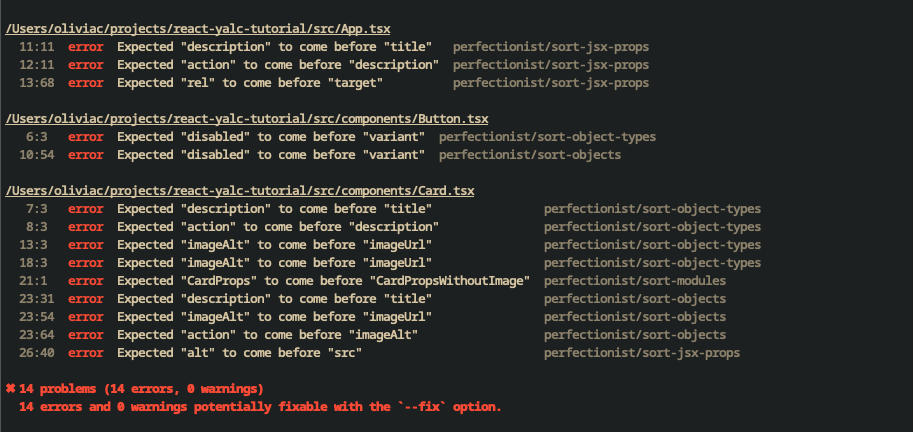

If you maintain an npm package, you might want to test changes locally in an app that depends on it before publishing. This article shows how to do that using [`yalc`](https://www.npmjs.com/package/yalc), an alternative to `npm link` and `yarn link`.

In this tutorial, we’ll use a common real-world example: a shared frontend configuration package consumed by an application. We’ll add new configuration settings to the frontend config package and test how those changes affect the app that uses it without publishing or pushing any code on GitHub.

> This tutorial uses a React-based example, but the workflow using yalc is the same regardless of whether you use Vue, Svelte, or another framework.

## Initial setup

In this tutorial, we’ll use two repositories:

- [tutorial-frontend-config](https://github.com/liv7c/tutorial-frontend-config): this is the repository containing the frontend configuration to be shared across projects. It contains ESLint and Prettier configuration files.
- [react-yalc-tutorial](https://github.com/liv7c/react-yalc-tutorial): it’s a small application built with [Vite](https://vite.dev/). It is a typical React/TypeScript app with a few components. It already uses the `tutorial-frontend-config`.

```bash
# Clone the frontend config package and install its dependencies
git clone git@github.com:liv7c/tutorial-frontend-config.git
cd tutorial-frontend-config
npm install

# Go back to your parent folder (if needed)
cd ..

# Clone the example React app and install its dependencies
git clone git@github.com:liv7c/react-yalc-tutorial.git
cd react-yalc-tutorial
npm install
```

Before we continue, let’s install `yalc` globally so it’s ready to use:

```bash
npm install -g yalc
```

Everything is set up, so let’s get started.

## Let’s update the config package

The `tutorial-frontend-config` repository contains all our shared frontend configuration rules for linting and formatting. We have a [published version on `npm`](https://www.npmjs.com/package/@oliviacl/tutorial-frontend-config), and several projects already depend on it.
Let’s say we want to try out a new ESLint plugin: [eslint-plugin-perfectionist](https://github.com/azat-io/eslint-plugin-perfectionist). It not only handles import ordering but also includes sorting rules for TypeScript types and component props.
Let’s go to our frontend config repo and create a new Git branch:

```bash
cd PATH_TO_REPO/tutorial-frontend-config
git switch -C feature/use-perfectionist-eslint-plugin
```

### A quick tour of the tutorial-frontend-config repository

The `tutorial-frontend-config` repository is an npm workspace. A workspace is a way to have multiple packages within the same repo. In this case, there are two packages:

- `configs` that contains the package published on npm.
- `example-app`: a demo app that consumes the configs package.

Here are a few useful details about npm workspaces:

- When you run `npm install` at the root of the workspace, it will install the dependencies of all workspace packages. This works thanks to the [`workspace` property in the root package.json](https://github.com/liv7c/tutorial-frontend-config/blob/main/package.json#L6-L9):

```json
// in package.json
  "workspaces": [
    "packages/*",
    "example-app"
  ],
```

- Packages can reference each other. I have an example app in the repo that [references the other workspace package in its dependencies](https://github.com/liv7c/tutorial-frontend-config/blob/main/example-app/package.json#L19C1-L19C47):

```json
// in example-app/package.json
    "@oliviacl/tutorial-frontend-config": "*",
```

When you want to work on a specific package inside a monorepo, navigate into that package’s folder. Each package has its own package.json file, which contains specific dependencies. In our case, we’ll be working in the `configs` package.

```bash
cd tutorial-frontend-config/packages/configs
```

### Let’s add the Perfectionist plugin to our ESLint config

The goal is to modify the ESLint config to use a new plugin: [eslint-plugin-perfectionist](https://github.com/azat-io/eslint-plugin-perfectionist).

> Make sure you are in the correct directory (`tutorial-frontend-config/packages/configs`).

If we examine the `eslint.js` file, we currently use `eslint-plugin-import` with a few rules. With eslint-plugin-perfectionist, we can remove `eslint-plugin-import` and the rules we had for this plugin, as the perfectionist plugin will handle those functionalities. In the `packages/configs` directory, run:

```bash
npm uninstall eslint-plugin-import
```

Then remove all references to `eslint-plugin-import` from `eslint.js`:

```js
// remove import
import importPlugin from "eslint-plugin-import";

// eslint.js
export default [
	// delete the plugin from the plugins section
  plugins: {
	  // Delete the following line
	  import: importPlugin,
  },
  rules: {
	  // Delete this block in the rules
      'import/order': [
        'warn',
        {
          groups: ['builtin', 'external', 'internal', 'parent', 'sibling', 'index'],
          'newlines-between': 'always',
          alphabetize: { order: 'asc', caseInsensitive: true },
        },
      ],
	}
]
```

Let’s commit those changes:

```bash
git add . && git commit -m 'chore(eslint): remove eslint-plugin-import with rules'
```

Then, let’s install the new ESLint plugin (make sure you are still in the `packages/configs` directory):

```bash
npm install eslint-plugin-perfectionist
```

We add it as a dependency so projects using our config don’t need to install it themselves.

Let’s update our ESLint config to use the plugin. We can use a ready-made config as mentioned in the [plugin documentation](https://github.com/azat-io/eslint-plugin-perfectionist?tab=readme-ov-file#configs).

First, import the plugin:

```js
// in eslint.js
import perfectionist from 'eslint-plugin-perfectionist';
```

Then, add the perfectionist plugin:

```js
// in eslint.js

export default [
  js.configs.recommended,
  ...tseslint.configs.recommended,
  perfectionist.configs['recommended-natural'],
  // ...
];
```

Let’s commit this:

```bash
git add . && git commit -m "feat(eslint): add perfectionist plugin"
```

## Testing our changes with yalc

This is where `yalc` comes in. We want to test the changes we made to our ESLint config before pushing or publishing the changes.

### Publishing our package locally via yalc publish

`yalc` creates a local store on your computer inside a `~/.yalc` directory. We can publish packages to this directory. `yalc` then makes it easy to use the packages published to that local store in applications that depend on them.

In the `packages/configs` directory, run:

```bash
yalc publish
```

After running the command, you should see the following message in your terminal:

```bash
@oliviacl/tutorial-frontend-config@1.0.4 published in store.
```

If you inspect the `.yalc` directory in your home folder, you should see the following structure:

```bash
❯ tree ~/.yalc
.yalc
├── installations.json
└── packages
    └── @oliviacl
        └── tutorial-frontend-config
               └── 1.0.4
                ├── CHANGELOG.md
                ├── eslint.d.ts
                ├── eslint.js
                ├── index.d.ts
                ├── index.js
                ├── package.json
                ├── prettier.d.ts
                ├── prettier.js
                ├── README.md
                └── yalc.sig

5 directories, 11 files
```

### Adding the package via yalc add

Now, let’s change directory and move to the tutorial application we cloned in the previous section:

```bash
cd PATH_TO_REPO/react-yalc-tutorial
```

Make sure you’ve run `npm install` first. Now, to use our package published in the yalc local store, we only need to run:

```bash
yalc add @oliviacl/tutorial-frontend-config
```

If you open your package.json, you’ll see that the dependency was replaced with a reference to the `.yalc` directory:

```json
	// in your package.json
  "devDependencies": {
    "@oliviacl/tutorial-frontend-config": "file:.yalc/@oliviacl/tutorial-frontend-config",
  }


```

Inside the repo, you should also see a `.yalc` folder containing the latest version of your package. When you run `yalc add`, `yalc` copies the package from the `~/.yalc` store into your repo.

Run `npm install`. This will install any new dependencies required by the updated ESLint config.

If you run `npm run lint`, you should see new warnings coming from this new plugin:



It works!

### Making multiple changes and propagating them with `yalc push`

Now, let’s say we want to make more changes to `tutorial-frontend-config`. In `tutorial-frontend-config`, we could modify the prettier config and update it to use double quotes, for instance:

```js
// in packages/configs/prettier.js
export default {
  semi: true,
  trailingComma: 'es5',
  // we switch singleQuote from true to false
  singleQuote: false,
  printWidth: 100,
  tabWidth: 2,
  useTabs: false,
  arrowParens: 'always',
  endOfLine: 'lf',
};
```

To propagate the changes, no need to run `yalc publish`. You can run:

```bash
# run this command from packages/configs
yalc push
```

`yalc push` pushes the changes to the Yalc store and automatically updates all projects using the published version in yalc.

You should see a command output that looks like this:

```bash
@oliviacl/tutorial-frontend-config@1.0.4 published in store.
Pushing @oliviacl/tutorial-frontend-config@1.0.4 in /Users/YOUR_USERNAME/projects/react-yalc-tutorial
Package @oliviacl/tutorial-frontend-config@1.0.4 added ==> /Users/YOUR_USERNAME/projects/react-yalc-tutorial/node_modules/@oliviacl/tutorial-frontend-config
```

If you go back to the `react-yalc-tutorial` project and open the `.yalc` folder, you should see that the Prettier file has been updated. And if you run `npx prettier --check src` or enable format-on-save, you should see the new Prettier rules being applied.

### Cleaning things up when done testing with `yalc remove`

Once we’re done testing, we can run the following command inside `react-yalc-tutorial`:

```bash
yalc remove @oliviacl/tutorial-frontend-config
```

This command removes the yalc entry from `package.json` and cleans up the `yalc.lock` file.

If you’re testing multiple packages with yalc and want to remove all of them at once, run:

```bash
yalc remove --all
```

## Working with component libraries

In this tutorial, we worked with a configuration package that doesn’t require a build step. However, the workflow with `yalc` is almost the same when working with a component library that has a build step.
The only difference is that you will want to run `npm run build` to build your library before running `yalc publish` or `yalc push`. `yalc` will copy all the files that should be published, using your package.json as a source of truth.

```bash
npm run build && yalc publish
```

## Conclusion

In this post, we looked at how to use `yalc` to test a package locally without publishing it or pushing any changes. It’s a very useful tool for trying out changes locally.
`yalc` is a great alternative to `npm link` or `yarn link` and, as you saw in the example, is pretty straightforward to use.

I hope this tutorial was helpful! As always, if you have any questions or would like to chat, don’t hesitate to reach out on [Bluesky](https://bsky.app/profile/oliviac.dev).

## Extra resources

- [yalc repository](https://github.com/wclr/yalc)
- [Documentation on npm workspaces if you are curious](https://docs.npmjs.com/cli/v7/using-npm/workspaces?v=true)
